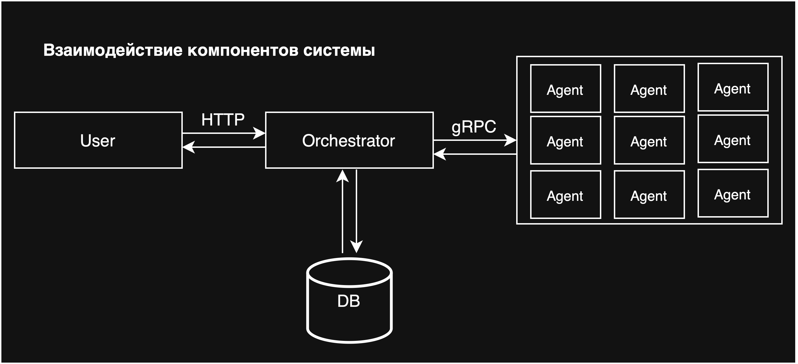
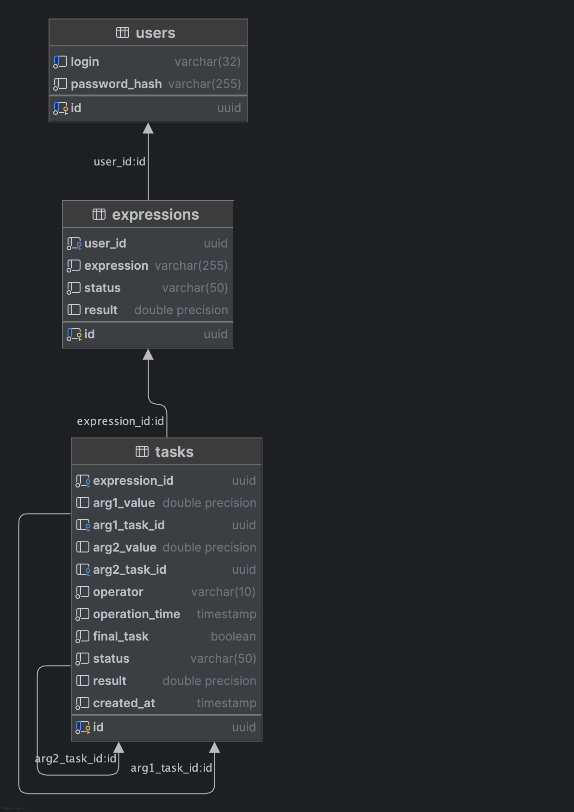

# calculator-service

## Описание проекта

Этот сервис предоставляет веб-API для вычисления арифметических выражений. Пользователь отправляет HTTP-запрос с
выражением и, в случае ошибки, сразу получает соответствующее сообщение. Вычисления выполняются асинхронно, а
результат доступен при запросе списка всех выражений или по их уникальному идентификатору (ID). Доступна поддержка
регистрации и авторизации.

**Поддерживаемые операции:**

* Сложение (+)
* Вычитание (-)
* Умножение (*)
* Деление (/)

**Поддерживаемые типы чисел:**

* Целые числа
* Вещественные числа

### Выполненность критериев оценки (если они не сменились на этапе проверки):

1. ✅ Весь реализованный ранее функционал работает как раньше, только в контексте конкретного пользователя - 20 баллов
2. ✅ У кого выражения хранились в памяти - переводим хранение в SQLite. (теперь наша система обязана переживать
   перезагрузку) - 20 баллов
   > Используется PostgreSQL вместо SQLite, что разрешено
3. ✅ У кого общение вычислителя и сервера вычислений было реализовано с помощью HTTP - переводим взаимодействие на
   GRPC - 10 баллов
4. ✅ Проект покрыт модульными тестами - 10 баллов
   > Модульные тесты расположены рядом с соответствующими `.go`-файлами.<br>(Например: `server.go` → `server_test.go`)
5. ✅ Проект покрыт интеграционными тестами - 10 баллов
   > Интеграционные тесты лежат в отдельных пакетах `orchestrator/tests/integration` и `agent/tests/integration`

---

## Тестирование

Модульные тесты расположены рядом с соответствующими `.go`-файлами.<br>(Например: `server.go` → `server_test.go`)

Интеграционные тесты лежат в отдельных пакетах `orchestrator/integration_test` и `agent/integration_test`

⚠️ **Внимание:**

Из-за сгенерированных `.proto` файлов и моков (которые не надо покрывать тестами), процент покрытия кода падает примерно
в 2
раза, поэтому если Вы запускаете тесты с покрытием, то показываемый процент - **неверный**.

Запуск тестов:

```bash
go test ./...
```

---

## Запуск сервиса

### ⚠️ Внимание

Если у вас не запускается проект (например, из-за некорректной установки Docker, занятых портов, ошибочно
скопированной команды или по другим причинам, не связанным с реализацией системы), это не значит, что надо ставить
автоматически 0 балов. Сначала проверьте, в чём заключается проблема. Если что-то не так, напишите в канал
«Вопрос-ответ», указав ссылку на проект, чтобы можно было помочь.

1. Установить **Docker**
2. Склонировать репозиторий
   ```bash
   git clone https://github.com/alexGoLyceum/calculator-service.git
   ```
3. Перейти в папку с проектом
   ```bash
   cd calculator-service
   ```
4. Проверить, что все зависимости установлены
   ```bash
   go mod tidy
   ```

5. Запустить сервис
     ```bash
     docker-compose up --build
     ```

## Схема работы сервиса

### Взаимодействие

**Оркестратор** - сервер, который принимает арифметическое выражение, переводит его в набор последовательных задач и
обеспечивает порядок их выполнения.

**Агент** - Вычислитель, который может получить от оркестратора задачу, выполнить его и вернуть серверу результат.

> Если агент выйдет из строя, выражение, которое он обрабатывал, со временем вернётся в очередь задач на выполнение.



### Преобразование выражения в RPN и создание задач


### Схема базы данных



## Эндпоинты

> Curl-запросы написаны для macOS. Если Вы используете Windows, вместо них можно воспользоваться Postman

### ⚠️ Важно: порядок выполнения тестовых запросов

Примеры команд для работы с сервисом нужно выполнять последовательно, так как:

1. Команды используют переменные окружения терминала (`TOKEN` и `EXPRESSION_ID`), которые задаются при выполнении
   определённых запросов. Это позволяет упростить выполнение последующих команд
    - `TOKEN` — токен аутентификации.
    - `EXPRESSION_ID` — ID последнего созданного выражения.
2. Ограничение сессии

   Эти переменные существуют только в текущей сессии терминала. Если вы закроете терминал или откроете новое окно,
   переменные будут недоступны — их потребуется задать повторно.

### Регистрация

`POST /api/v1/register`

Регистрация нового пользователя.

Требования к паролю:

- Длина от 8 до 25 символов
- Минимум одна заглавная буква
- Минимум одна строчная буква
- Минимум одна цифра
- Минимум один специальный символ (!@#$%?&*)

Коды ответа:

- 200 - успешная регистрация
- 400 - невалидные данные
- 422 - пользователь уже существует / слабый пароль / недопустимый логин
- 503 - сервис временно недоступен
- 500 - внутренняя ошибка сервера

Запрос:

```bash
curl --location "<хост>:<порт>/api/v1/register" \
--header "Content-Type: application/json" \
--data '{
  "login": "<логин>",
  "password": "<пароль>"
}'
````

Ответ (успех):

```json
{
  "token": "<JWT токен>"
}
```

Ответ (ошибка):

```json
{
  "error": "<сообщение об ошибке>"
}
```

Пример запроса:

```bash
TOKEN=$(curl -s --location "http://localhost:8080/api/v1/register" \
--header "Content-Type: application/json" \
--data '{
  "login": "test_user",
  "password": "SecurePass123!"
}' | jq -r '.token')

echo "Полученный токен: $TOKEN"
```

### Авторизация

`POST /api/v1/login`

Авторизация пользователя.

Коды ответа:

- 200 - успешная авторизация
- 400 - невалидные данные
- 401 - неверный логин или пароль
- 503 - сервис временно недоступен
- 500 - внутренняя ошибка сервера

Запрос:

```bash
curl --location "<хост>:<порт>/api/v1/login" \
--header "Content-Type: application/json" \
--data '{
  "login": "<логин>",
  "password": "<пароль>"
}'
```

Ответ (успех):

```json
{
  "token": "<JWT токен>"
}
```

Ответ (ошибка):

```json
{
  "error": "<сообщение об ошибке>"
}
```

Пример запроса:

```bash
TOKEN=$(curl -s --location "http://localhost:8080/api/v1/login" \
--header "Content-Type: application/json" \
--data '{
  "login": "test_user",
  "password": "SecurePass123!"
}' | jq -r '.token')

echo "Токен: $TOKEN"
```

### Вычисления выражений

`POST /api/v1/calculate`

Добавление арифметического выражения для вычисления.

⚠️ Требуются JWT токен в заголовке Authorization

Коды ответа:

- 201 - выражение принято для вычисления
- 400 - невалидные данные
- 401 - неавторизованный доступ
- 422 - невалидное выражение
- 404 - пользователь не найден
- 503 - сервис временно недоступен
- 500 - внутренняя ошибка сервера

---

Запрос:

```bash
curl --location "<хост>:<порт>/api/v1/calculate" \
--header "Content-Type: application/json" \
--header "Authorization: Bearer <JWT токен>" \
--data '{
  "expression": "<строка с математическим выражением>"
}'
```

Ответ (успех):

```json
{
  "id": "<уникальный идентификатор выражения>"
}
```

Ответ (ошибка):

```json
{
  "error": "<сообщение об ошибке>"
}
```

Пример запроса:

```bash
RESPONSE=$(curl -s --location "http://localhost:8080/api/v1/calculate" \
--header "Content-Type: application/json" \
--header "Authorization: Bearer $TOKEN" \
--data '{
  "expression": "2 + 2 * 2"
}')

EXPRESSION_ID=$(echo "$RESPONSE" | jq -r '.id')

echo "ID выражения: $EXPRESSION_ID"
```

### Получение списка выражений

`GET /api/v1/expressions`

Получение списка всех выражений пользователя.

⚠️ Требуются JWT токен в заголовке Authorization

Коды ответа:

- 200 - успешно получен список выражений
- 401 - неавторизованный доступ
- 404 - пользователь не найден
- 503 - сервис временно недоступен
- 500 - внутренняя ошибка сервера

Запрос:

```bash
curl --location "<хост>:<порт>/api/v1/expressions" \
--header "Authorization: Bearer <JWT токен>"
```

Ответ (успех):

```json
{
  "expressions": [
    {
      "id": "<идентификатор>",
      "expression": "<строка выражения>",
      "status": "<статус>",
      "result": "<результат>"
    }
  ]
}
```

Ответ (пустой список):

```json
{
  "expressions": []
}
```

Пример запроса:

```bash
curl --location "http://localhost:8080/api/v1/expressions" \
--header "Authorization: Bearer $TOKEN"
```

### Получение выражения по ID

`GET /api/v1/expressions/:id`

Получение информации о конкретном выражении.

⚠️ Требуются JWT токен в заголовке Authorization

Коды ответа:

- 200 - успешно получено выражение
- 400 - невалидный ID
- 401 - неавторизованный доступ
- 404 - выражение не найдено
- 503 - сервис временно недоступен
- 500 - внутренняя ошибка сервера

Запрос:

```bash
curl --location "<хост>:<порт>/api/v1/expressions/<ID выражения>" \
--header "Authorization: Bearer <JWT токен>"
```

Ответ (успех):

```json
{
  "expression": {
    "id": "<идентификатор>",
    "expression": "<строка выражения>",
    "status": "<статус>",
    "result": "<результат>"
  }
}
```

Ответ (ошибка):

```json
{
  "error": "<сообщение об ошибке>"
}
```

Пример запроса:

```bash
curl --location "http://localhost:8080/api/v1/expressions/$EXPRESSION_ID" \
--header "Authorization: Bearer $TOKEN"
```

### Проверка доступности

`GET /api/v1/ping`

Проверка доступности сервиса.

Код ответа:

- 200 - сервис доступен

Запрос

```bash
curl --location "<хост>:<порт>/api/v1/ping"
```

Ответ

```text
pong
```

Пример запроса:

```bash
curl --location "http://localhost:8080/api/v1/ping"
```

### gRPC API для агентов

### AssignTasks (stream)

Получение задач для вычисления агентами.

Запрос:

```
message AssignTasksRequest {}
```

Ответ (stream):

```
message Task {
  string id = 1;
  string expression_id = 2;
  double arg1_num = 3;
  double arg2_num = 4;
  string operator = 5;
  google.protobuf.Timestamp operation_time = 6;
  bool final_task = 7;
}
```

### SubmitTask

Отправка результата вычисления задачи.

Запрос:

```
message SubmitTaskRequest {
  Task task = 1;
  double result = 2;
}
```

Ответ:

```
message SubmitTaskResponse {}
```