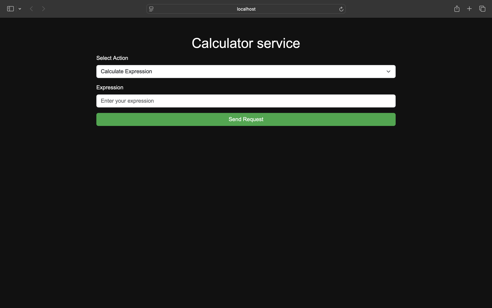
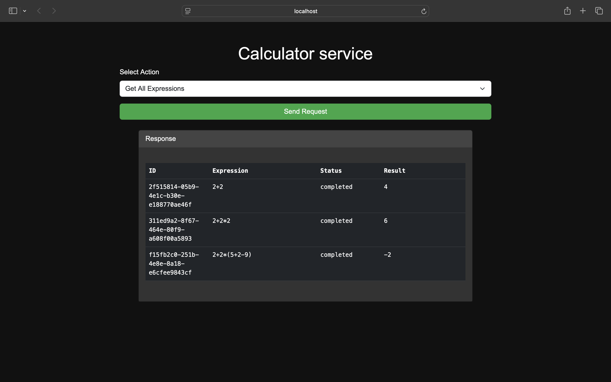
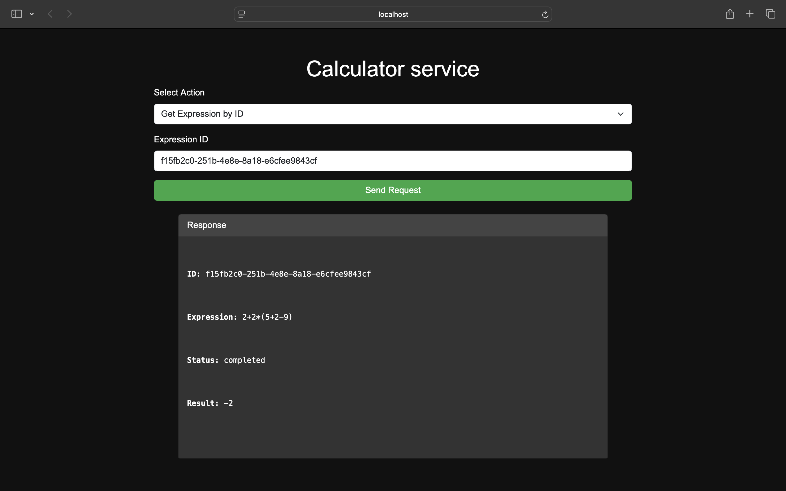

# calculator-service

## Описание проекта

Этот сервис предоставляет веб-API для вычисления арифметических выражений. Пользователь отправляет HTTP-запрос с
выражением и, в случае ошибки, сразу получает соответствующее сообщение. Вычисления выполняются асинхронно, а
результат доступен при запросе списка всех выражений или по их уникальному идентификатору (ID).

**Поддерживаемые операции:**

* Сложение (+)
* Вычитание (-)
* Умножение (*)
* Деление (/)

**Поддерживаемые типы чисел:**

* Целые числа
* Вещественные числа

### Выполненность критериев оценки (если они не сменились на этапе проверки):

1. ✅ Существует Readme документ, в котором описано, как запустить систему и как ей пользоваться. Этот пункт дает 20
   баллов. Без наличия такого файла - решение не проверяется.
    1. ✅ Это может быть docker-compose, makefile, подробная инструкция - на ваш вкус
    2. ✅ В Readme описаны примеры запросов с помощью curl-a или любым другими понятными образом
    3. ✅ Примеры полны и понятно, как их запустить
    4. ✅ У системы есть документация со схемами, которая наглядно отвечает на вопрос: "Как это всё работает

2. ✅ Программа запускается, и все примеры с вычислением арифметических выражений корректно работают - 20 баллов

3. ✅ Программа запускается, и выполняются произвольные примеры с вычислением арифметических выражений - 20 баллов

4. ✅ :) Вам понятна кодовая база и структура проекта - 20 баллов (это субъективный критерий, но чем проще ваше решение -
   тем лучше). Проверяющий в этом пункте честно отвечает на вопрос: "Смогу я сделать пулл-реквест в проект без нервного
   срыва?"

5. ✅ Наличие веб-интерфейса дает дополнительные 20 баллов

---

## Требования

- Go **1.19+**

---

## Запуск сервиса

1. Склонировать репозиторий
   ```bash
   git clone https://github.com/alexGoLyceum/calculator-service.git
   ```
2. Перейти в папку с проектом
   ```bash
   cd calculator-service
   ```
3. Проверить, что все зависимости установлены
   ```bash
   go mod tidy
   ```
4. Конфигурации могут быть заданы в файле `.env` или через переменные среды. Если какие-либо параметры не указаны, будут
   использованы значения по умолчанию.

   | Параметр                  | Описание                                            | Значение по умолчанию |
   |---------------------------|-----------------------------------------------------|-----------------------|
   | `ORCHESTRATOR_HOST`       | Адрес хоста для оркестратора                        | `localhost`           |
   | `ORCHESTRATOR_PORT`       | Порт оркестратора                                   | `8080`                |
   | `TIME_ADDITION_MS`        | Время выполнения операции сложения в миллисекундах  | `1000`                |
   | `TIME_SUBTRACTION_MS`     | Время выполнения операции вычитания в миллисекундах | `1000`                |
   | `TIME_MULTIPLICATIONS_MS` | Время выполнения операции умножения в миллисекундах | `1000`                |
   | `TIME_DIVISIONS_MS`       | Время выполнения операции деления в миллисекундах   | `1000`                |
   | `COMPUTING_POWER`         | Количество горутин для параллельных вычислений      | `5`                   |
   | `LOG_LEVEL`               | Уровень логирования                                 | `debug`               |
   | `LOG_PATH`                | Путь к файлу для логирования                        | `logs.log`            |

   #### ⚠️ Важно:

    1. Не меняйте хост и порт оркестратора, потому что, например, если оркестратор и агент запускаются с передачей
       переменных среды, например: `ORCHESTRATOR_HOST=8081 go run cmd/orchestrator/main.go`, то агент также должен
       получать
       те же
       переменные:`ORCHESTRATOR_HOST=8081 go run cmd/agent/main.go`, чтобы обеспечить корректное подключение к
       оркестратору при изменении хоста или порта
    2. **Фронтенд запускается на localhost:8080** и этот параметр нельзя изменить, поэтому при использовании фронтенда,
       сервер и агент должны быть запущены на localhost:8080 (значения по умолчанию)


5. Запустить оркестратор

  ```bash
  go run cmd/orchestrator/main.go
  ```

6. Запустить агентов

  ```bash
  go run cmd/agent/main.go
  ```

7. Чтобы открыть сайт, перейдите в папку `web` и откройте файл `index.html` через браузер
   > Так как агенты используют два внутренних эндпоинта GET и POST /api/v1/internal/task для общения с оркестратором, то
   эти методы специально не представлены во фронтенде для взаимодействия с пользователем.

   
   
   

---

8. Также сервис можно запустить через Make

   **⚠️ Внимание:** Не изменяйте значения переменных окружения, используемых для запуска сервиса, особенно хоста и
   порта. Это поможет избежать возможных ошибок в работе
    * Установить Make, если еще не установлен
    * Запустить сервис
   ```bash
   make run
   ```
    * **Не забудьте остановить сервис**
   ```bash
   make stop
   ```
   Если что-то работает неправильно (это может случиться, если Вы некорректно завершили работу сервиса), поэтому
   проверьте, не занят ли порт, на котором вы пытаетесь запустить сервис (по умолчанию 8080), и, если процесс найден,
   завершите его.

   **На macOS**
    1. Найдите процесс
   ```bash
   lsof -i :8080
   ```
    2. Завершите процесс
       <PID> - идентификатор запушенного процесса. В нашем случае нужен процесс с флагом LISTEN
   ```bash
   kill -9 <PID>
   ```

## Схема работы сервиса

### Взаимодействие

**Оркестратор** - сервер, который принимает арифметическое выражение, переводит его в набор последовательных задач и
обеспечивает порядок их выполнения.

**Агент** - Вычислитель, который может получить от оркестратора задачу, выполнить его и вернуть серверу результат.

> ⚠️ Если агент выйдет из строя, выражение, которое он обрабатывал, со временем вернётся в очередь задач на выполнение.


### Преобразование выражения в RPN и создание задач


### Алгоритм отправки задания, установки результата, получения всех выражений, получения выражения по ID, проверки "потерянных" заданий


## Эндпоинты

> Curl-запросы написаны для macOS. Если Вы используете Windows, вместо них можно воспользоваться Postman

`POST /api/v1/calculate`

Добавление вычисления арифметического выражения

Коды ответа:

- 201 - выражение принято для вычисления
- 422 - невалидные данные
- 500 - что-то пошло не так

Запрос

```bash
curl --location "<хост>:<порт>/api/v1/calculate" \
--header "Content-Type: application/json" \
--data '{
  "expression": "<строка с математическим выражением>"
}'
```

Ответ (успех)

```json
{
  "id": "<уникальный идентификатор выражения>"
}
```

Ответ (ошибка)

```json
{
  "error": "сообщение об ошибке"
}
```

**Пример запроса с успешным вычислением выражения:**

```bash
curl --location "localhost:8080/api/v1/calculate" \
--header "Content-Type: application/json" \
--data '{
  "expression": "2+2*2"
}'
```

**Ответ:**

```json
{
  "result": "6"
}
```

**Пример запроса с ошибкой:**

```bash
curl --location "localhost:8080/api/v1/calculate" \
--header "Content-Type: application/json" \
--data '{
  "expression": "2/0"
}'
```

**Ответ:**

```json
{
  "error": "division by zero is not allowed"
}
```

`GET /api/v1/expressions`

Получение списка выражений

Коды ответа:

- 200 - успешно получен список выражений
- 500 - что-то пошло не так

Запрос

```bash
curl --location '<хост>:<порт>/api/v1/expressions'
```

**Пример запроса с получением выражений:**

```bash
curl --location 'localhost:8080/api/v1/expressions'
```

**Ответ #1:**

```json
{
  "expressions": [
    {
      "id": "de6d9e01-348c-490d-b37b-07d430864894",
      "expression": "2+2*2",
      "status": "completed",
      "result": 6
    }
  ]
}
```

**Ответ #2 (если в системе еще нет выражений):**

```json
{
  "expressions": []
}
```

`GET /api/v1/expressions/id:`

Получение выражения по его идентификатору

Коды ответа:

- 200 - успешно получен список выражений
- 404 - нет такого выражения
- 500 - что-то пошло не так

Запрос

```bash
curl --location '<хост>:<порт>/api/v1/expressions/:id'
```

**Пример запроса:**

```bash
id=$(curl -s --location "localhost:8080/api/v1/calculate" \
--header "Content-Type: application/json" \
--data '{
  "expression": "2+2*2"
}' | jq -r '.id')

curl -s --location "localhost:8080/api/v1/expressions/$id"
```

**Ответ:**

```json
{
  "expression": {
    "id": "4b3e88fa-dafe-4299-b0e9-a19b30af19fd",
    "expression": "2+2*2",
    "status": "pending"
  }
}
```

**Пример запроса:**

```bash
id=$(curl -s --location "localhost:8080/api/v1/calculate" \
--header "Content-Type: application/json" \
--data '{
  "expression": "2+2*2"
}' | jq -r '.id')

sleep 1

curl -s --location "localhost:8080/api/v1/expressions/$id"
```

**Ответ:**

```json
{
  "expression": {
    "id": "bd16957c-8aa8-4164-a279-f725d9754ae1",
    "expression": "2+2*2",
    "status": "in progress"
  }
}
```

**Пример запроса:**

```bash
id=$(curl -s --location "localhost:8080/api/v1/calculate" \
--header "Content-Type: application/json" \
--data '{
  "expression": "2+2*2"
}' | jq -r '.id')

sleep 3

curl -s --location "localhost:8080/api/v1/expressions/$id"
```

**Ответ:**

```json
{
  "expression": {
    "id": "981a387e-2105-4fbd-be0b-2e7bc449a164",
    "expression": "2+2*2",
    "status": "completed",
    "result": 6
  }
}
```

`GET /api/v1/internal/task`

Получение задачи для выполнения

Коды ответа:

- 200 - успешно получен список выражений
- 404 - нет задачи
- 500 - что-то пошло не так

Запрос

```bash
curl --location '<хост>:<порт>/api/v1/internal/task'
```

**Пример запроса с получением выражений:**

```bash
curl --location 'localhost:8080/api/v1/internal/task'
```

**Примера ответа:**

```json
{
  "task": {
    "id": "0b6a6ed9-4df5-4796-a4e1-ac3ed9c05a6e",
    "expression_id": "aaa9ae33-82a4-43d0-994c-f080534cc913",
    "arg1": {
      "value": 2,
      "task_id": "00000000-0000-0000-0000-000000000000"
    },
    "arg2": {
      "value": 2,
      "task_id": "00000000-0000-0000-0000-000000000000"
    },
    "operator": "*",
    "operation_time": "2025-03-03T21:45:03.719229+03:00",
    "final_task": false
  }
}
```

`POST /api/v1/internal/task`

Прием результата обработки данных

Коды ответа:

- 200 - успешно получен список выражений
- 404 - нет задачи
- 500 - что-то пошло не так

Запрос

```bash
curl --location "<хост>:<порт>/api/v1/internal/task" \
--header "Content-Type: application/json" \
--data '{
   "task": {
      "id": "<идентификатор задачи>",
      "expression_id": "<идентификатор выражения>",
      "arg1": {
         "value": <значение>,
         "task_id": "<идентификатор задачи>"
      },
      "arg2": {
         "value": <значение>,
         "task_id": "<идентификатор задачи>"
      },
      "operator": "<оператор>",
      "operation_time": <время операции>,
      "final_task": <true/false>
   },
   "result": <результат>
}'
```

**Пример запроса:**

```bash
curl --location "localhost:8080/api/v1/internal/task" \
--header "Content-Type: application/json" \
--data '{
    "task": {
        "id": "35bda1af-44ca-408e-b80d-02af364c3b0c",
        "expression_id": "65a54e56-6454-44dc-a468-4fc302a0229f",
        "arg1": {
            "value": 2,
            "task_id": "00000000-0000-0000-0000-000000000000"
        },
        "arg2": {
            "value": 2,
            "task_id": "00000000-0000-0000-0000-000000000000"
        },
        "operator": "*",
        "operation_time": "2025-03-03T21:59:45.28886+03:00",
        "final_task": false
    },
    "result": 4
}'
```

---

## Тестирование

```bash
go test ./...
```

